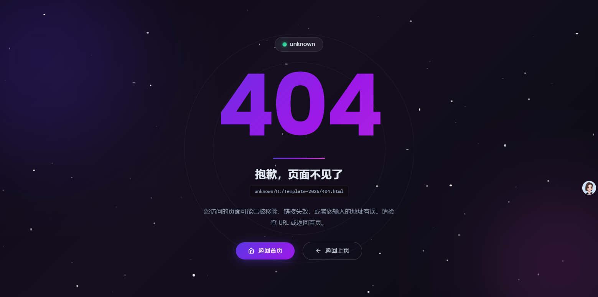
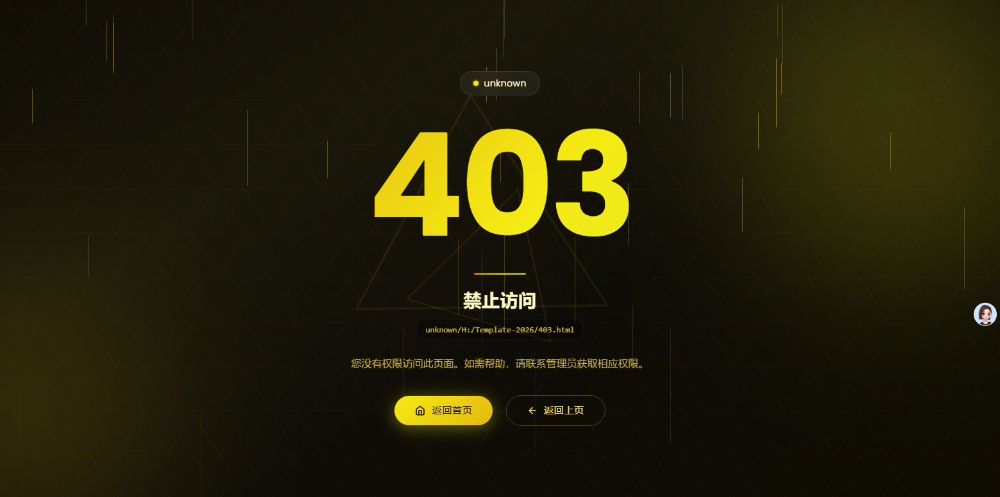
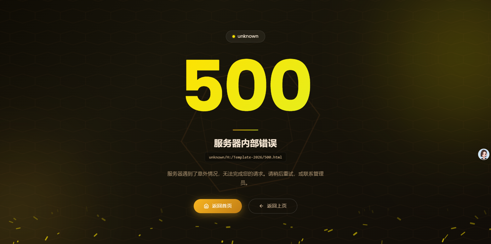
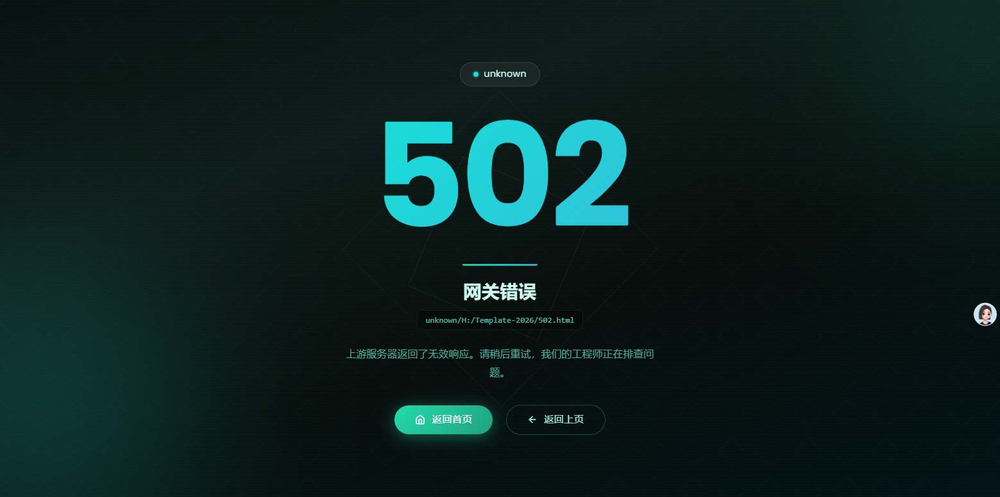

# cool-dynamic-error-page
汇聚全网高颜值动态 404、500 错误页面，全部自带沉浸式视觉特效，主打渐变流动配色、浩瀚星空背景、柔和呼吸灯光影，简约高级、适配各类网站后端、个人站点、开源项目报错页一键套用。

#页面预览





# HTTP 错误页面模板项目分析报告

> 分析日期：2026-05-18

---

## 一、项目概览

本项目是一个 **HTTP 错误页面模板集合**，包含 5 个静态 HTML 文件，分别对应常见的 HTTP 错误状态码。所有页面均为独立自包含文件（内联 CSS + JS），可直接部署到 Nginx、Apache、Cloudflare 等 Web 服务器作为自定义错误页面使用。

| 文件 | 状态码 | 中文含义 | 文件大小 |
|------|--------|----------|----------|
| [403.html](403.html) | 403 | 禁止访问 | 12,217 字节 |
| [404.html](404.html) | 404 | 页面未找到 | 12,923 字节 |
| [500.html](500.html) | 500 | 服务器内部错误 | 11,896 字节 |
| [502.html](502.html) | 502 | 网关错误 | 10,881 字节 |
| [503.html](503.html) | 503 | 服务暂不可用 | 12,781 字节 |

---

## 二、共性特征

### 2.1 技术栈

- **纯静态页面**：HTML5 + CSS3 + 原生 JavaScript，无框架依赖
- **外部依赖**：
  - Bootstrap 4.0.0 CSS（CDN：`cdn.jsdelivr.net`）
  - Google Fonts Poppins 字体（`fonts.googleapis.com`）
- **语言**：所有页面语言标记为 `zh-CN`（简体中文）

### 2.2 页面布局结构

所有页面采用统一的信息层级，从上到下依次为：

```
┌────────────────────────────┐
│     域名徽章 (domain-badge)  │  ← 显示当前访问域名，带状态指示灯
│     错误代码 (error-code)    │  ← 大号渐变数字，shimmer 动画
│     分割线 (divider)        │  ← 渐变色脉冲动画线
│     错误标题 (error-title)  │  ← 中文简要说明
│     请求路径 (request-path) │  ← 显示完整请求 URL
│     错误描述 (error-desc)   │  ← 中文详细说明与建议
│   [返回首页] [返回上页]      │  ← 两个操作按钮
└────────────────────────────┘
```

### 2.3 通用组件

| 组件名称 | 说明 |
|----------|------|
| `glow-orb` | 2 个高斯模糊发光球体，浮动动画，营造环境光氛围 |
| `domain-badge` | 胶囊形徽章，实时显示 `window.location.hostname`，带呼吸灯圆点 |
| `request-path` | 等宽字体的路径显示条，展示 `hostname + pathname + search` |
| `error-code` | `clamp(8rem, 18vw, 14rem)` 响应式字号，渐变文字 shimmer 动画 |
| `divider` | 80px→140px 脉冲宽度动画分割线 |
| 按钮组 | "返回首页"主按钮 + "返回上页"描边按钮，带 SVG 图标 |

### 2.4 响应式设计

所有页面在 `max-width: 576px` 断点下统一调整：

- 错误代码字号缩小至 `6rem`
- 标题字号 `1.3rem`，描述字号 `0.9rem`
- 按钮变为块级元素，占满宽度，垂直排列
- 域名徽章内边距和字号略微缩小

### 2.5 随机配色引擎

每个页面都包含一个 **HSL→Hex 随机配色引擎**，机制如下：

1. 每次页面加载时，在预设的色相（Hue）范围内随机取值
2. 通过 `hslToHex()` 函数动态生成 3 个主题色 `--c1`、`--c2`、`--c3`
3. 自动派生背景色、发光色、按钮色、阴影色等一系列 CSS 变量
4. 通过 `document.documentElement.style.setProperty()` 注入 `:root`

这意味着 **同一错误页面每次打开都有微妙的色彩变化**，避免视觉疲劳。

---

## 三、各页面差异化设计

### 3.1 配色方案对比

| 页面 | 主色调 | 色相范围 | 氛围感受 |
|------|--------|----------|----------|
| 403 | 琥珀金 | 35° ~ 55° | 警示、权威 |
| 404 | 紫罗兰/品红 | 240° ~ 290° | 科技、探索 |
| 500 | 橙色 | 15° ~ 45° | 温暖、紧急 |
| 502 | 青碧/蓝绿 | 155° ~ 185° | 冷静、技术 |
| 503 | 玫红 | 335° ~ 360° | 柔和、安抚 |

### 3.2 背景图案对比

| 页面 | 背景图案 | 实现方式 | 动画 |
|------|----------|----------|------|
| 403 | 三角形网格 | 内联 SVG Data URI × 2（正/反三角） | `tri-shift` 22s 无限位移 |
| 404 | 星空粒子 | JS 动态生成 80 个 `.star` div | `twinkle` 闪烁，随机延迟 |
| 500 | 六边形网格 | 内联 SVG Data URI | `hex-drift` 20s 无限位移 |
| 502 | 菱形网格 + CRT 扫描线 | 内联 SVG rotated rect + `repeating-linear-gradient` | `diamond-drift` 18s 位移 |
| 503 | 脉冲波纹圆 | 5 层 `radial-gradient` 同心圆 | `ripple-pulse` 6s 呼吸缩放 |

### 3.3 装饰几何元素对比

| 页面 | 装饰元素 | 实现方式 | 动画 |
|------|----------|----------|------|
| 403 | 三角形旋转框 × 2 | SVG 三角多边形，一大一小 | 18s / 13s 反向旋转 |
| 404 | 几何旋转环 × 2 | CSS border 圆形 | 30s / 25s 正反旋转 |
| 500 | 六边形旋转框 × 2 | SVG 六边形多边形，一大一小 | 20s / 15s 反向旋转 |
| 502 | 菱形旋转框 × 2 | CSS border 方形旋转 45° | 16s / 12s 反向旋转 |
| 503 | 扩散环形 × 3 | CSS border 圆形，级联延迟 | 5s 缩放+淡出，三层错开 |

### 3.4 粒子特效对比

| 页面 | 粒子类型 | 数量 | 运动方式 | 视觉效果 |
|------|----------|------|----------|----------|
| 403 | 光束线条 | 40 | 垂直下落 + 拉长 | 光柱穿过画面 |
| 404 | 星星光点 | 80 | 原地闪烁 + 缩放 | 星空闪烁 |
| 500 | 浮动碎片 | 50 | 上升 + 横向漂移 + 旋转 | 火花飘散 |
| 502 | 无粒子 | — | — | 仅 CRT 扫描线 |
| 503 | 雨滴 | 60 | 垂直下落 | 雨丝效果 |

### 3.5 特殊设计细节

- **[404.html](404.html)**：唯一使用网卡灯（NIC light）风格的域名指示灯。圆点带有 `::after` 伪元素波纹扩散效果，且设计了 5 个关键帧的复杂闪烁动画（模拟网络活动指示灯的双脉冲节奏）。
- **[502.html](502.html)**：唯一包含 CRT 扫描线效果（`scanlines`），通过 `repeating-linear-gradient` 实现半透明横纹，模拟终端/监视器屏幕感。也是唯一没有 JS 生成粒子的页面。
- **[503.html](503.html)**：唯一使用三层级联扩散环（`ring-outer` / `ring-mid` / `ring-inner`）作为装饰，以 `expand-ring` 动画营造信号向外传播的感觉，呼应"等待重试"的语义。
- **[403.html](403.html)**：主按钮文字颜色为深色（`--btn-text: #1a1400`），与其他页面使用白色文字不同，适合浅色琥珀按钮背景。

---

## 四、文案设计对比

| 页面 | 标题 | 描述文案 |
|------|------|----------|
| 403 | 禁止访问 | 您没有权限访问此页面。如需帮助，请联系管理员获取相应权限。 |
| 404 | 抱歉，页面不见了 | 您访问的页面可能已被移除、链接失效，或者您输入的地址有误。请检查 URL 或返回首页。 |
| 500 | 服务器内部错误 | 服务器遇到了意外情况，无法完成您的请求。请稍后重试，或联系管理员。 |
| 502 | 网关错误 | 上游服务器返回了无效响应。请稍后重试，我们的工程师正在排查问题。 |
| 503 | 服务暂时不可用 | 服务器正在维护或暂时过载，请稍后刷新页面重试。给您带来不便敬请谅解。 |

文案风格：
- 语气从 **403 的正式严肃** → **404 的友好亲切** → **50x 的歉意安抚**
- 50x 系列均包含"请稍后重试"建议
- 503 额外表达歉意（"敬请谅解"）

---

## 五、质量评估

### 5.1 优点

1. **视觉统一性**：5 个页面共享相同的布局骨架和代码风格，形成一致的品牌体验
2. **色彩语义化**：不同错误类型使用不同色调，符合心理感知（如 403 用金色传达权威、503 用玫红传达柔和）
3. **动态配色**：随机引擎确保每次访问有微妙变化，降低用户焦虑
4. **纯静态可部署**：零构建步骤，直接放置到 Web 服务器即可工作
5. **信息实用**：显示域名和请求路径，方便用户截图反馈问题
6. **响应式适配**：移动端布局可读
7. **性能较好**：除 2 个 CDN 请求外，全部内联，无额外网络请求

### 5.2 潜在改进点

1. **外部依赖风险**：依赖 Google Fonts 和 jsDelivr CDN，在国内网络环境下可能加载缓慢或失败。建议将 Bootstrap 关键样式内联化，字体使用系统字体回退。
2. **无障碍性（a11y）**：缺少 ARIA 标签、`<main>` 语义标签和 `role` 属性，屏幕阅读器体验较弱。
3. **`history.back()` 边界情况**：当用户直接访问错误页面（无历史记录）时，返回上页按钮无效；需考虑 fallback 逻辑。
4. **502 功能简化**：502 是唯一没有 JS 粒子特效的页面（文件也最小），与其他页面不够统一。
5. **缺少 401 页面**：常见 HTTP 错误码 401（未授权）未覆盖，与 403 场景不同（401=未登录，403=已登录但权限不足）。
6. **国际化**：当前仅支持中文，可考虑根据浏览器语言偏好自动切换。

---

## 六、代码复用分析

5 个页面存在大量重复代码，重复率约 **75%**。主要差异集中在：

- `:root` CSS 变量默认值（约 15 行）
- 背景图案 CSS（约 30 行）
- 装饰元素 CSS + HTML（约 20 行）
- 粒子系统 CSS + JS（约 25 行）
- 配色色相范围和按钮颜色逻辑（约 5 行）

如果未来需要扩展更多状态码（如 401、429、503 变体等），建议将公共部分抽取为模板引擎（如 Nunjucks、EJS）的基板，每个页面只定义差异化配置。

---

## 七、总结

本项目是一套设计精良的 HTTP 错误页面模板，5 个页面在统一的架构下各自拥有独特的色彩主题和动效风格。页面采用**深色主题 + 渐变色 + 动态粒子 + 玻璃态 UI 元素**的现代设计语言，适合用于企业网站、SaaS 平台、API 网关等场景的自定义错误页。

核心设计原则：**同构异色**——相同骨架，不同皮肤，通过色彩心理学区分错误类型的严重程度和属性。

